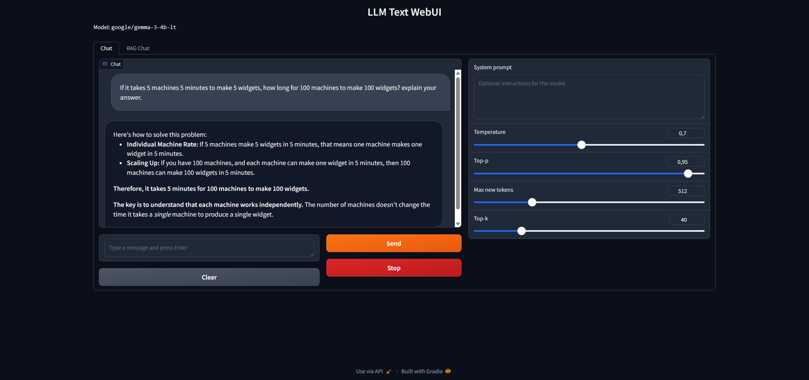
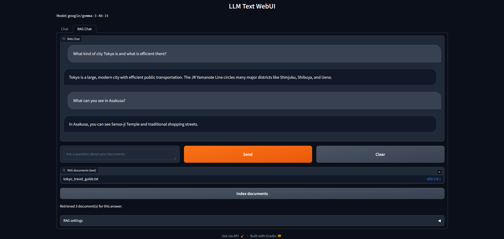

# LLM Gradio WebUI (text + RAG).

A Gradio web interface for text generation (Gemma3 4B default model).

## Screenshots




## Requirements

- NVIDIA GPU (8GB+ VRAM)
- Python 3.11+
- CUDA 12.1+

## Installation

1. Clone the repository:
```
git clone https://github.com/vpakarinen2/llm-text-gradio-webui.git
cd llm-text-gradio-webui
```

2. Create/activate virtual environment:
```
python -m venv .venv

# Windows
.venv\Scripts\activate

# Linux/Mac
source .venv/bin/activate
```

3. Install PyTorch with CUDA:
```
pip install --index-url https://download.pytorch.org/whl/cu121 torch torchvision torchaudio
```

4. Install dependencies:
```
pip install -r requirements.txt
```

5. Create `.env` file:
```
EMBED_MODEL_ID=sentence-transformers/all-MiniLM-L6-v2
MODEL_ID=google/gemma-3-4b-it
TORCH_DTYPE=bfloat16
HOST=localhost
DEVICE=cuda
SHARE=False
PORT=7860

QUEUE_CONCURRENCY_LIMIT=1
MAX_NEW_TOKENS=128
TEMPERATURE=0.7
TOP_P=0.95
TOP_K=40

GRADIO_ANALYTICS_ENABLED=False
```

## Hugging Face Token

1. Log in to Hugging Face
2. Create an access token (Settings → Access Tokens).
3. Log in:
```
huggingface-cli login
```

## Usage

```
python -m app.server
```

## Author

Ville pakarinen (@vpakarinen2)
