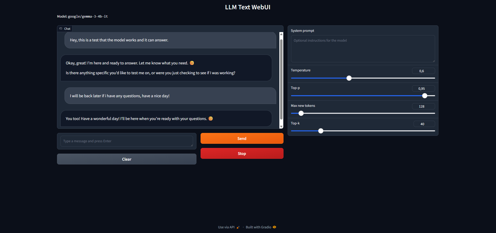

# LLM Text WebUI

A Gradio web interface for text generation (Gemma3 4B as a default model).

## Screenshots



## Requirements

- NVIDIA GPU (8GB+ VRAM)
- Python 3.11+
- CUDA 12.1+

## Installation

1. Clone the repository:
```
git clone https://github.com/vpakarinen2/llm-text-gradio-webui.git
cd llm-text-gradio-webui
```

2. Create/activate virtual environment:
```
python -m venv .venv

# Windows
.venv\Scripts\activate

# Linux/Mac
source .venv/bin/activate
```

3. Install PyTorch with CUDA:
```
pip install torch --index-url https://download.pytorch.org/whl/cu121
```

4. Install dependencies:
```
pip install -r requirements.txt
```

5. Create `.env` file:
```
HF_TOKEN=<HF_token_here>
MAX_NEW_TOKENS=128
DEVICE=cuda
```

## Usage

```
python -m app.server
```

Open http://localhost:7860 in your browser.

## Configuration

Environment variables (`.env`):

| Variable | Description | Default |
|----------|-------------|---------|
| `HF_TOKEN` | Hugging Face API token | Required |
| `DEVICE` | Device to use (`cuda` or `cpu`) | `cuda` |
| `MAX_NEW_TOKENS` | Default max tokens to generate | `128` |

## Author

Ville pakarinen (@vpakarinen2)
